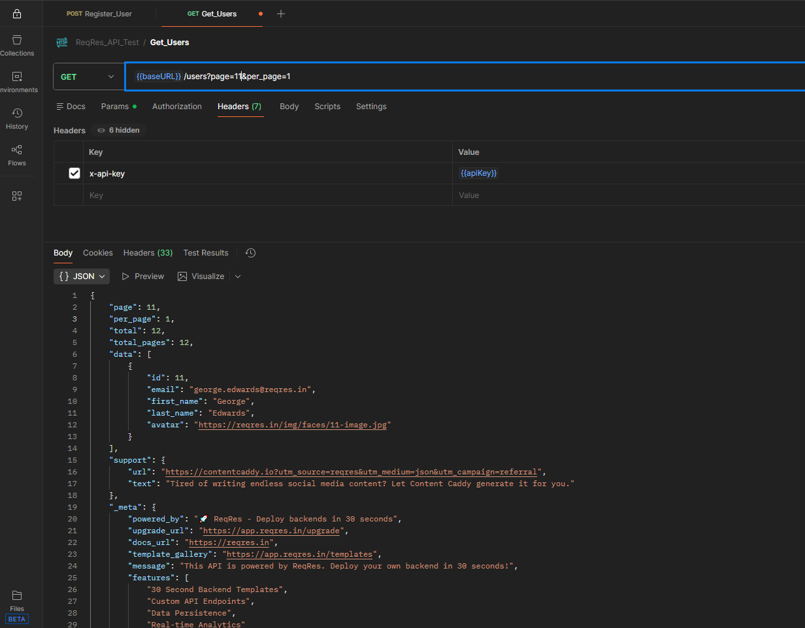
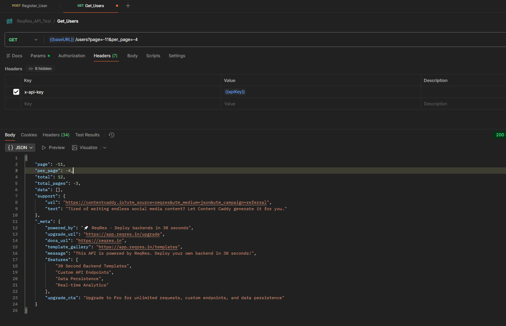
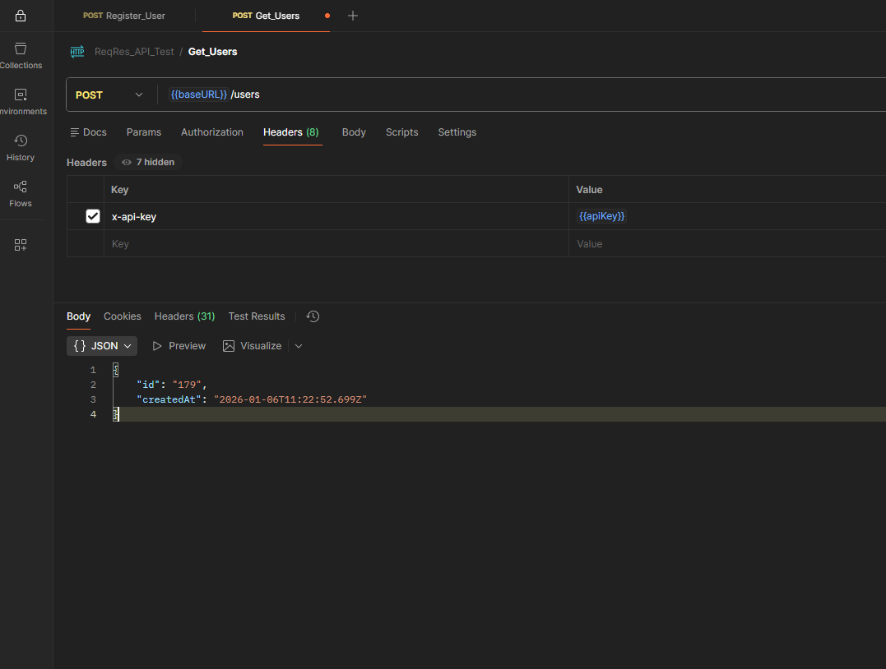
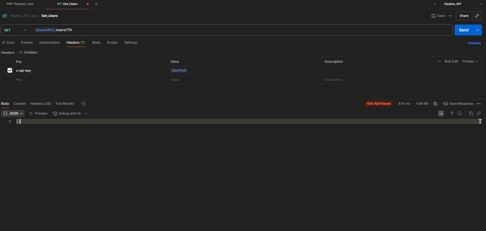

### Found Behaviours  
1. The `users` endpoint returns a list of users in the system 
2. It has two params `page` and `per_page` that works pretty fine in happy path values e.g.
```md  
`{{baseURL}}/users?page=2` 
`{{baseURL}}/users?page=2`
... 
`{{baseURL}}/users?page=12&per_page=1`
```  



### Inconsistent Behaviours    
1. `Improper Validation of Pagination Parameters`  
- `page` and `per_page` query parameters does not handle negative values properly. e.g.
```md
`{{baseURL}}/users?page=-11&per_page=-4`
```
For this request the response body shows, `"page": -11` and `"total_pages": -3` where `total_pages == 12 / per_page` 
`PoC`
    
`Expected:`   
- The API should validate query parameters.
- Negative or invalid values should be rejected with `HTTP 400` Bad Request.

`Actual:`  
Negative values are accepted and reflected in the response.

Impact:
Leads to incorrect pagination data and breaks API reliability.  
`Issue Type:` Validation   

---   
2. `Inconsistent Behavior When Using Unsupported HTTP Methods`  
- In the responses body `Access-Control-Allow-Methods` are `GET, POST, PUT, DELETE, OPTIONS`. If we change the method to `POST`
and hit the `/users` API endpoint, the response body says a random user is created. 
But if we search with the respective ID, we will find no member info under it
`PoC`
a) Create a user  
  
b) Respective user is not found  
  

`Expected:`   
- Reject unsupported methods with `HTTP 405` Method Not Allowed 
- Return consistent and persistent user data if creation is allowed  
- If `GET` is a valid endpoint, it should be clearly documented  
`Issue Type:` Data Integrity 