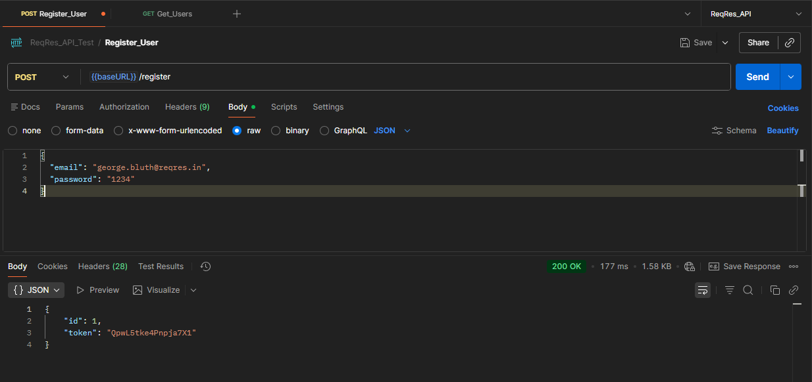
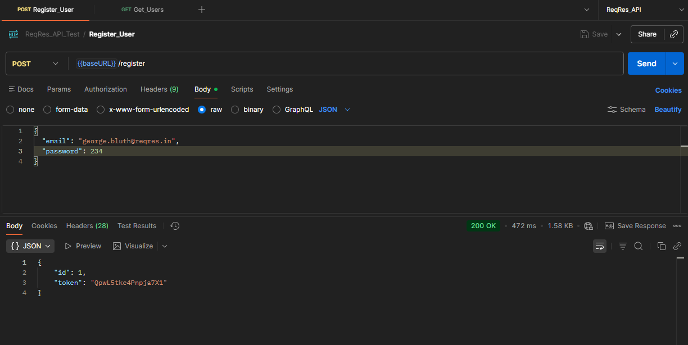
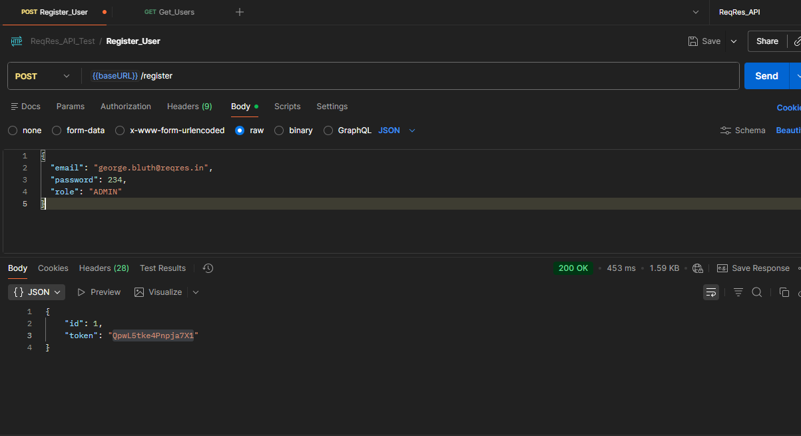
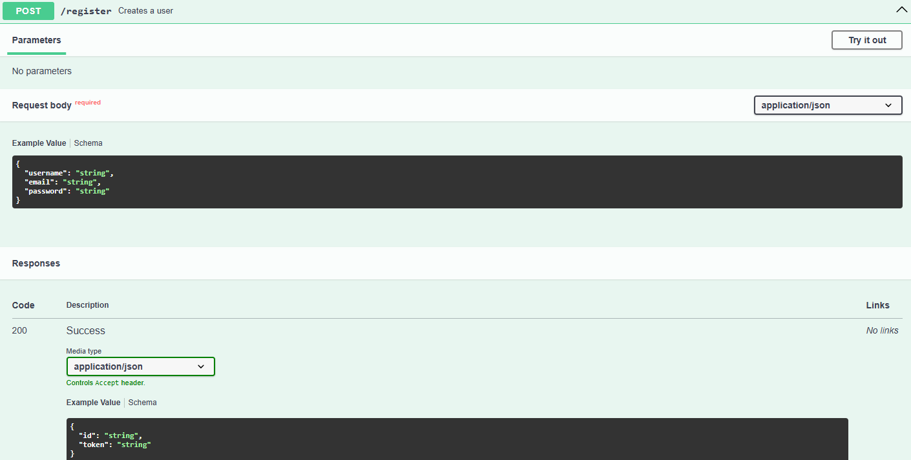
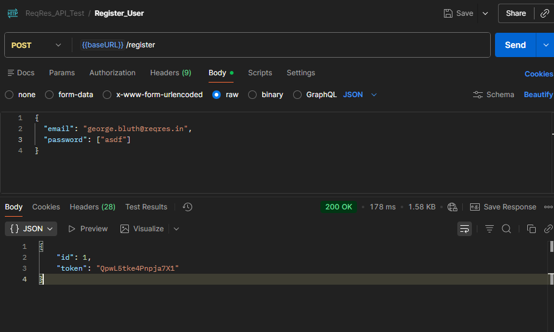

### Found Behaviours    
1. The `registration` endpoint creates a user and returns an `id` and `token`     
   


### Inconsistent Behaviours  
1. According to the documentation, the request body is 
```json
{
  "username": "string",
  "email": "string",
  "password": "string"
}
```
But the actual working request body is   
```json
{
  "email": "george.bluth@reqres.in",
  "password": "string or an integer" 
}
```      
   

`Expected:`   
- Request payload should strictly follow the documented schema.
- Data types should be validated (e.g., password must be a string).

`Actual:`     
- The `username` field is ignored.
- The `password` field accepts integer data type.

`Impact:`    
Breaks API contract and may introduce data integrity issues.  

---   

2.`Duplicate User Creation with Same Email: ` Multiple users can be created by the same `email` that returns the same `id` no.    

`Expected:`  
The API endpoint should reject duplicate user registrations.
`Actual:`  
Duplicate registrations succeed without validation.
`Impact:`  
Can lead to identity conflicts and inconsistent user management.  

---  

3. `Static Authentication Token:` The returned `token` against a valid registration is a constant string `QpwL5tke4Pnpja7X1`  

`Expected:`    
Each registration should generate a unique, unpredictable token.

`Actual:`    
The same static token is returned for all users.

`Impact:`  
Indicates insecure token handling and predictable authentication design that can lead to unexpected user registration.     

---     

4. `Request body manipulation`: From security perspective, an attacker can add extra parameter like `"role": "ADMIN"` in the request body.
This may lead to privilege escalation.    
     
`Expected:`  
- Only documented and permitted fields should be accepted.
- Unauthorised fields should be rejected with `HTTP 400` bad request.  

`Actual:`   
Extra fields are accepted without validation.

`Impact:`  
Potential security risk allowing privilege escalation or role manipulation.   

---   

5. `API Contract Validation in Response Data Type:` According to the documentation, the `id` value in the response body is expected to be a string data type, but it returns an integer  
  
     
`Expected:`    
- The `id` value should be string data type according to the documentation.

`Actual:`     
The `id` value in response body is an integer. 

`Impact:`    
This will create ambiguous front and backend issue if the response data is not handled properly.  
